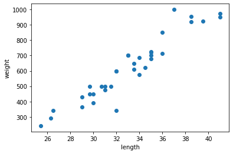

title: '머신러닝'

date: '2022-06-29-16-00'


## 파이썬 주요 라이브러리
- Machine learning
 + 정형데이터 
 + 사이킷런(Scikit-Learn)
 
- Deep Learming
 + 비정형데이터
 + TensorFlow(구글)vs Pytorch(페이스북)
 + 혼공머신은 텐서플로우
 + 실제 상용 서비스(텐서플로우) Vs R&D(파이터치->넘파이와 비슷한 용어)
 

## 생선분류(p.45)
 - 도미, 곤들매기, 농어 등등
 - 목표: 이생선들을 프록그램을 통해 분류한다
 - 30cm 이상이면 도미라고 알려줘라.


```python
fish_length = int(input('길이의 숫자로 넣어주세요:'))
if fish_length >=30:
   print("도미")
else:
   print("몰라") 
```

    길이의 숫자로 넣어주세요:20
    몰라
    

- 도미데이터(p.47)
## 데이터 수집


```python
# 도미 길이
bream_length = [25.4, 26.3, 26.5, 29.0, 29.0, 29.7, 29.7, 30.0, 30.0, 30.7, 31.0, 31.0, 31.5, 32.0, 32.0, 32.0, 33.0, 33.0, 33.5, 33.5, 34.0, 34.0, 34.5, 35.0, 35.0, 35.0, 35.0, 36.0, 36.0, 37.0, 38.5, 38.5, 39.5, 41.0, 41.0]
# 도미 무게
bream_weight = [242.0, 290.0, 340.0, 363.0, 430.0, 450.0, 500.0, 390.0, 450.0, 500.0, 475.0, 500.0, 500.0, 340.0, 600.0, 600.0, 700.0, 700.0, 610.0, 650.0, 575.0, 685.0, 620.0, 680.0, 700.0, 725.0, 720.0, 714.0, 850.0, 1000.0, 920.0, 955.0, 925.0, 975.0, 950.0]
```

## 데이터 가공
- 여기서는 생략

## 데이터 시각화
- 여러 인사이트를 확인하기 위해 시각화, 통계 수치 계산
- 탐색적 자료 분석(EDA : Exploratory Data Analysis) 


```python
import matplotlib.pyplot as plt

plt.scatter(bream_length, bream_weight)
plt.xlabel('length')
plt.ylabel('weight')
plt.show()
```


    

    


- 파이썬 시각화는 객체 지향으로 한다.
- 왜냐하면 좀 더 이쁘고 아름답게 다듬기 위해서
- 캐글 시각화 참고할 때 아래와 같이 하는 사람이 많음


```python
import matplotlib.pyplot as plt

fig, ax = plt.subplots()
ax.scatter(bream_length, bream_weight)
ax.set_xlabel('length')
ax.set_ylabel('weight')
plt.show()
```


    

    


- 빙어 데이터 준비하기


```python
smelt_length = [9.8, 10.5, 10.6, 11.0, 11.2, 11.3, 11.8, 11.8, 12.0, 12.2, 12.4, 13.0, 14.3, 15.0]
smelt_weight = [6.7, 7.5, 7.0, 9.7, 9.8, 8.7, 10.0, 9.9, 9.8, 12.2, 13.4, 12.2, 19.7, 19.9]
```


```python
fig, ax = plt.subplots()
ax.scatter(bream_length,bream_weight)
ax.scatter(smelt_length,smelt_weight)
ax.set_xlabel('length')
ax.set_ylabel('weight')
plt.show()
```


    

    


- 두개의 리스트 합치기


```python
length = bream_length + smelt_length
weight = bream_weight + smelt_weight
```

- 2차원 리스트로 만든다.


```python
fish_data = [[l,w] for l,w in zip(length, weight)]
fish_data [0:5] #5개만 추출
```


    [[25.4, 242.0], [26.3, 290.0], [26.5, 340.0], [29.0, 363.0], [29.0, 430.0]]


- 생선의 길이와 무게를 보고 빙어와 도미를 구분하고 싶다.
- 라벨링을 해준다=지도해준다=지도학습 


```python
fish_target = [1]* 35 + [0]*14
print(fish_taget)
```

    [1, 1, 1, 1, 1, 1, 1, 1, 1, 1, 1, 1, 1, 1, 1, 1, 1, 1, 1, 1, 1, 1, 1, 1, 1, 1, 1, 1, 1, 1, 1, 1, 1, 1, 1, 0, 0, 0, 0, 0, 0, 0, 0, 0, 0, 0, 0, 0, 0]
    


```python
from sklearn.neighbors import KNeighborsClassifier
# 클래스 인스턴스화
kn = KNeighborsClassifier()

# 모형학습
kn.fit(fish_data, fish_target)
```


    KNeighborsClassifier()


```python
# 예측 정확도
kn.score(fish_data, fish_target)
```


    1.0


- 실제 예측을 해보자
- 새로운 물고기 도착
 + 길이 :30 몸무게:600


```python
ac_length = int(input("물고기 길이를 입력하세요.."))
ac_weight= int(input("물고기 무게를 입력하세요.."))
preds = int(kn.predict([[ac_length,  ac_weight]]))
print(preds)

if preds == 1:
   print("도미")
else:
   print("빙어")
```

    물고기 길이를 입력하세요..35
    물고기 무게를 입력하세요..100
    0
    빙어
    
